# Eindproject_Jesse_Dierckx_API

[![Contributors][contributors-shield]][contributors-url]

  <h3 align="center">Api development Eindproject Jesse Dierckx</h3>

## Voordat we starten

Voordat we starten met elke screenshot zie je foto's bijkomen dit zijn de screenshots dat ik nam terwijl ik deze readme file aan het maken was dus maak u daar maar geen zorgen over

## Beschrijving thema

Als thema heb ik gekozen om een api te maken waar je users mee kunt maken waarvan elk van deze een lijstje kunnen maken,
waar ze informatie op kunnen zetten bijvoorbeeld dingen dat ze willen meenemen van de supermarkt of de mediamarkt.
Dit kan natuurlijk ook hgebruikt worden als memo voor dingen dat ze moeten doen.

## Algemene eisen & documentatie

- [x] Minstens 3 GET, 1 POST, 1 PUT en 1 DELETE endpoints
- [x] Minstens 3 entiteiten in je API via een SQLite databank
- [x] Minstens hashing en OAuth implementeren
- [x] Beschrijving van het gekozen thema, je API(s) en je uitbreidingen + link naar de zaken die hosted zijn op GitHub README.md
- [x] Aantoonbare werking totale API door screenshots van Postman requests op GitHub README.md
- [x] Volledige OpenAPI docs screenshot(s) op GitHub README.md
- [x] Logisch gebruik van path parameters, query parameters en body
- [x] Docker container voor de API(s), welke automatisch door GitHub Actions opgebouwd wordt
- [x] Deployment van de API container(s) op Okteto Cloud via Docker Compose

## Volledige OpenAPI docs screenshot(s) op GitHub README.md

als eerste zal ik de openapi docs screenshots laten zien omdat dit een goede overview geeft

Zoals je hieronder ook kan zien heb ik juist de user michiel aangemaakt ik zal wat screenshots verder naar onder dan ook een item aanmaken voor de user michiel

### Nu zal ik even de 2 post en 3 get functies laten zien:

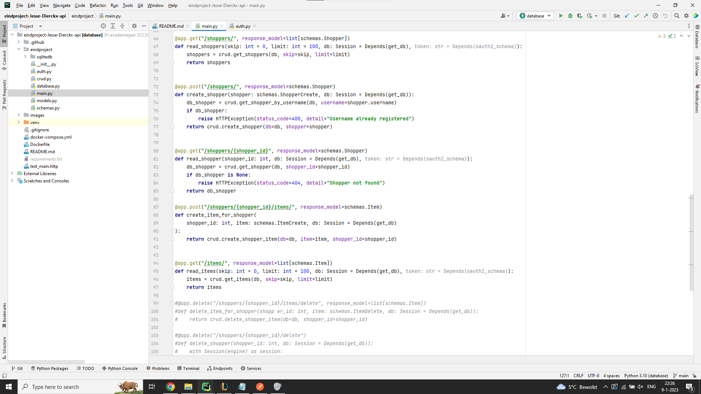
Zoals je hierboven kunt zien heb ik 2 post functions en 3 get functions exclusief de post voor de bearer token van een user op te vragen

## hashing en oauth implementatie:
zoals je hieronder kan zien is oauth en hashing correct geimplementeerd in een aparte python file zoals in de klas gedemonstreerd

## werking API door screenshots van postman requests:
Eerst zal ik de 3 gets laten zien en daarna zal ik de twee posts laten zien

### GET Requests

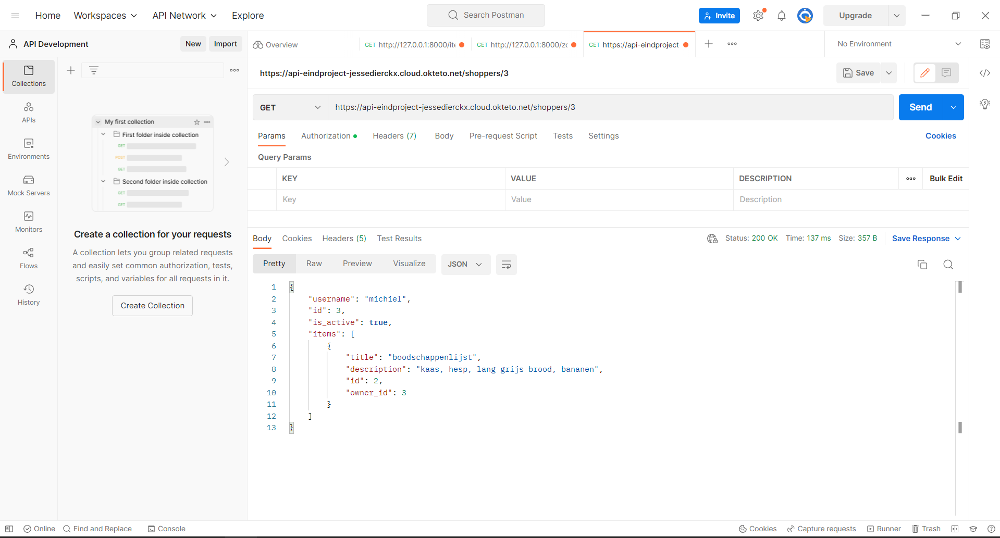
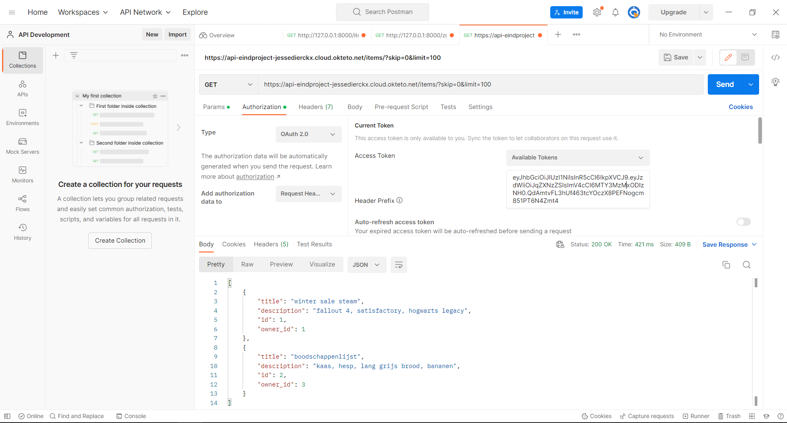

### POST Requests

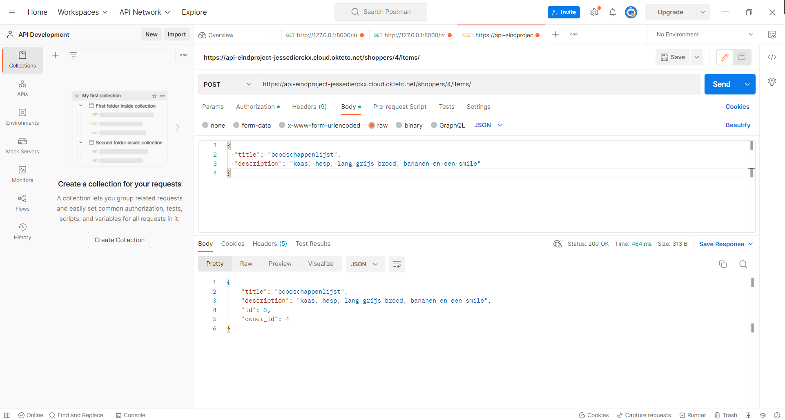

Zoals je kan zien werken de 3 gets en 2 posts helemaal correct

## Logisch gebruik van path parameters, query parameters en body:

Hieronder zal ik laten zien dat ik de correcte manier heb gebruikt om een crus op te stellen

### database file
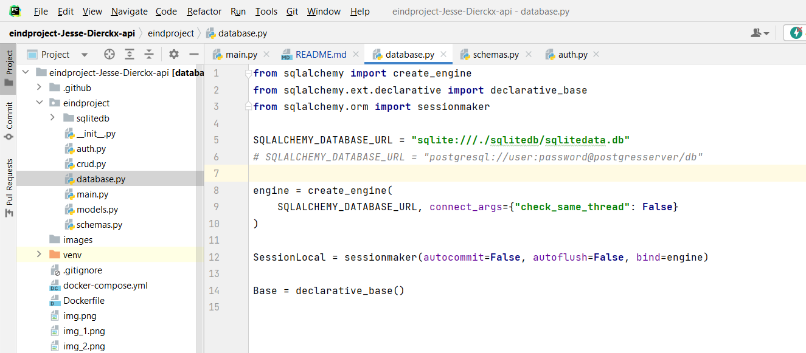
### crud file
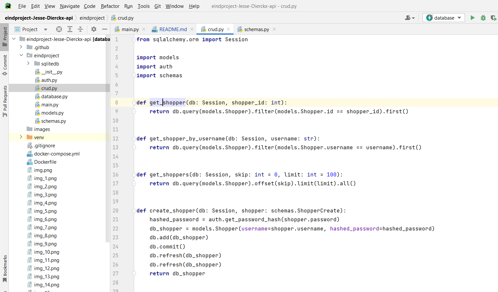
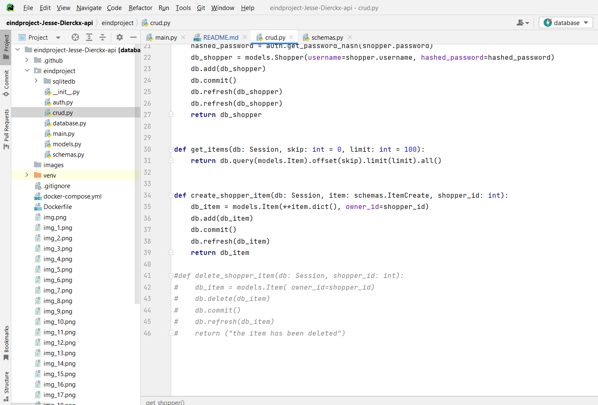
### models file
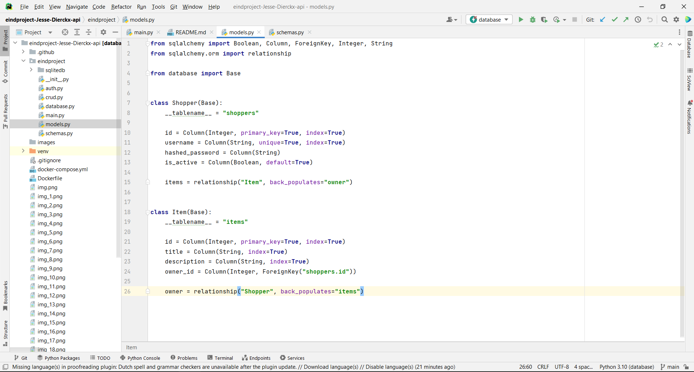
### schemas file
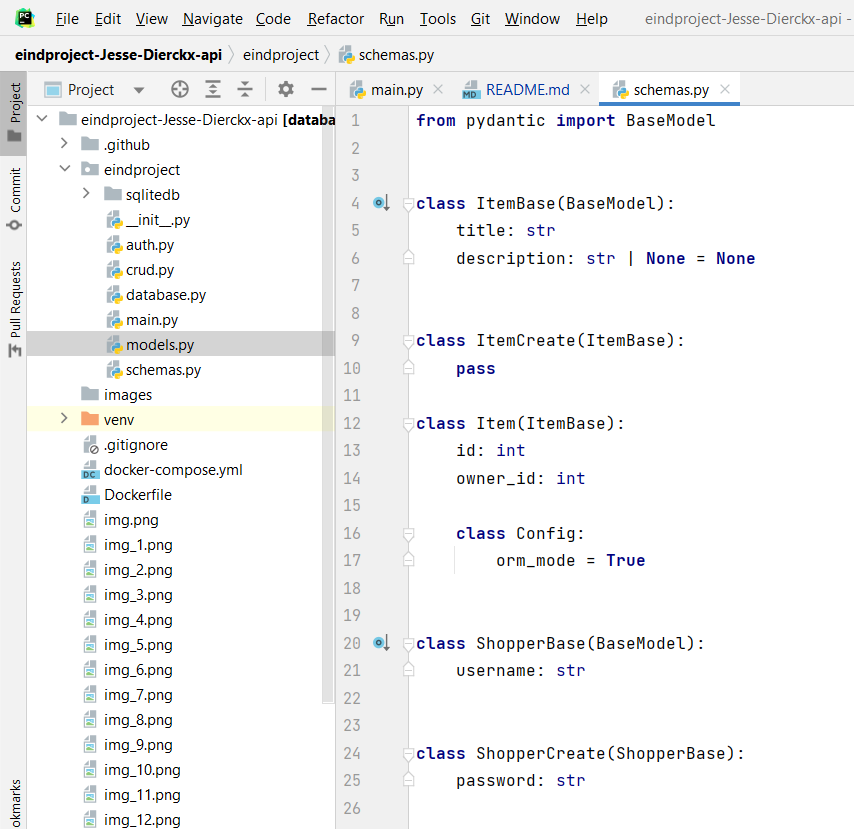
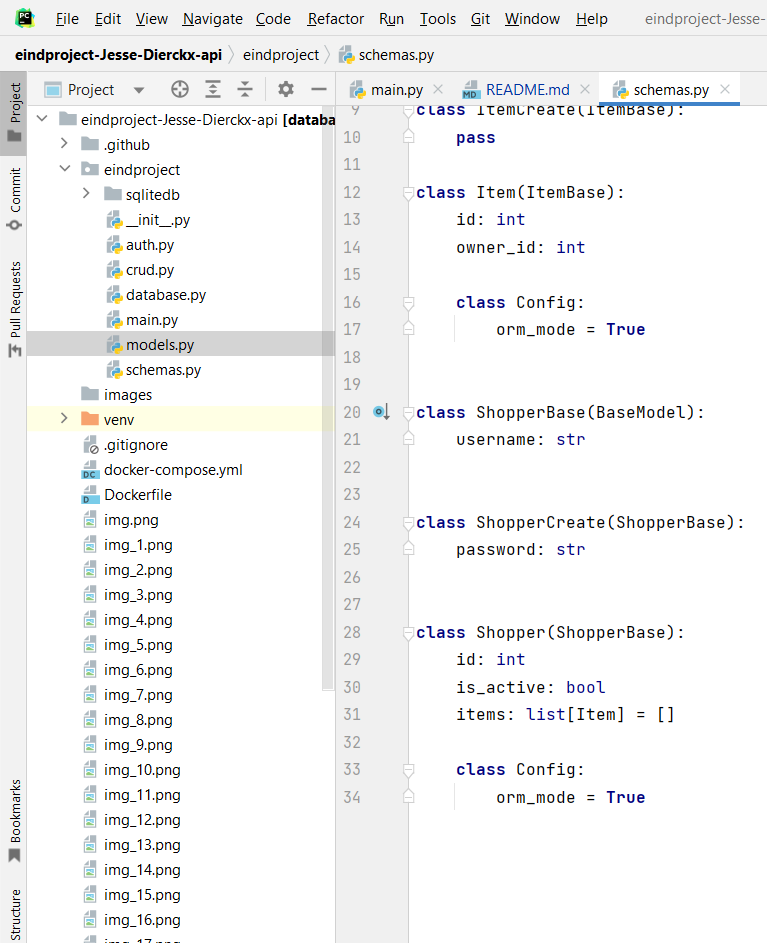

### Docker container voor de API(s), welke automatisch door GitHub Actions opgebouwd wordt:
## De Dockerfile
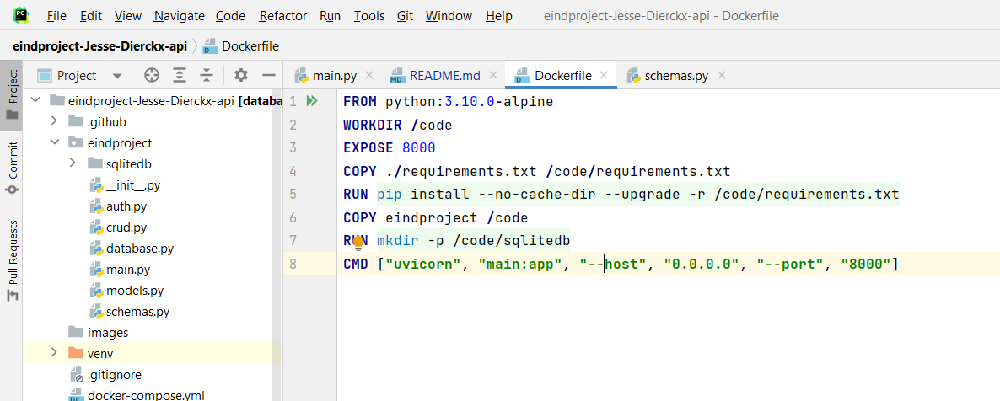

## De docker-compose file
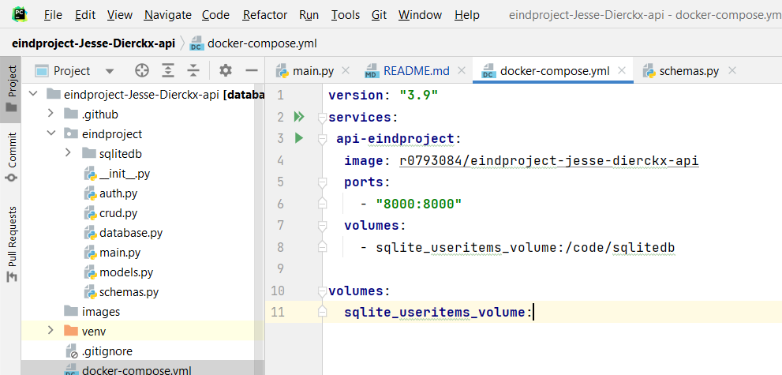
zoals je kan zien is alles op een fatsoenlijke manier opgebouwd.

### Github actions

### Als extra nog een screenshot van de database in DB browser for sqlite
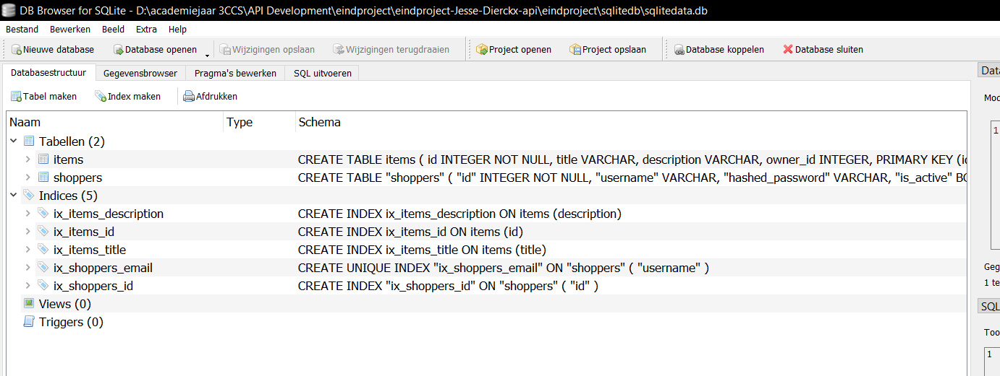

p.s de link helemaal vanboven is om naar mijn contributors pagina te gaan van mijn API repository.
en als je ziet dat de foto's weg zijn in mijn github repository ik heb deze later in de images map gezet.

[contributors-shield]: https://img.shields.io/github/contributors/othneildrew/Best-README-Template.svg?style=for-the-badge
[contributors-url]: https://github.com/JesseDierckx/eindproject-Jesse-Dierckx-api/graphs/contributors