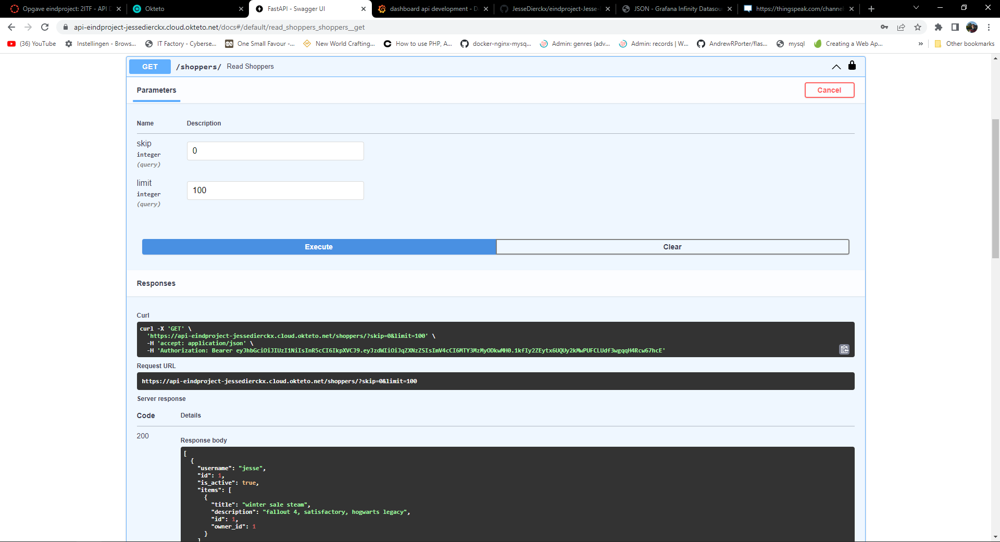

# API_Development_Jesse_Dierckx_API

[![Contributors][contributors-shield]][contributors-url]

  <h3 align="center">Api development Jesse Dierckx</h3>

## Voordat we starten

Voordat we starten met elke screenshot zie je foto's bijkomen dit zijn de screenshots dat ik nam terwijl ik deze readme file aan het maken was dus maak u daar maar geen zorgen over

## Algemene eisen & documentatie

- [x] 1 API in een GitHub repository 
- [x] 1 front-end in een GitHub repository 
- [x] Beschrijving van het gekozen thema, je API en je front-end + link naar hosted API, link naar front-end GitHub repository en link naar hosted front-end op GitHub README.md 
- [x] Aantoonbare werking totale API door screenshots van Postman requests op GitHub README.md 
- [x] Volledige OpenAPI docs screenshot(s) op GitHub README.md 
### REST API 
- [x] Minstens 2 GET endpoints 
- [x] Minstens 1 POST endpoint met class(es) 
- [x] Maximaal gebruik van validaties. Gebruik van response model wanneer aangewezen. 
- [x] Logisch gebruik van path parameters, query parameters en body 
### DEPLOYING 
- [x] Docker container voor de API, welke automatisch door GitHub Actions opgebouwd wordt 
- [x] Deployment van de API container op Okteto Cloud via Docker Compose FRONT-END 
- [x] Een simpele front-end, minstens op basis van AlpineJS 
- [ ] Deployment van de front-end

## Aantoonbaar totale werking api doormiddel van screenshots van postman requests

Deze screenshots hierboven zijn screenshots van de nba.py file waar mijn twee post functies en twee get functies instaan.

Hieronder zal ik doormiddel van postman screenshots laten zien vand de werking van de 2 post functies en de twee get functies.

dus als eerste de post en get functie van player:

Zoals je hierboven al ziet heb ik twee keer dezelfde post per ongeluk gerunt, dit is waarom dezelfde player 2 keer is aangemaakt.

Dan als volgende de post en get functie van team:

dit is dan ook gebeurd bij teams zoals je kan zien maar dit is alleen op localhost gebeurd niet op de hosted api zoals je hieronder kan zien:

## Open API Screenshots

## Deploying van de docker container
Deployen van de docker container gebeurt doormiddel van de Dockerfile, de docker-compose.yml file en de github workflow file zoals ik hieronder laat zien:

#### de Dockerfile:

#### de docker-compose.yml file:

#### de github workflow file:

Dit is allemaal succesvol gelopen zoals je kan zien aan de screenshots van de github actions en okteto build screens:
#### Github actions:

#### Okteto:

En tenslotte de frontend deze heb ik wel kunnen delpoyen maar niet aan de praat gekregen zoals je hieronder ziet:

#### Deployment

#### Error messages op de pagina zelf

p.s de link helemaal vanboven is om naar mijn contributors pagina te gaan van mijn API repository.

[contributors-shield]: https://img.shields.io/github/contributors/othneildrew/Best-README-Template.svg?style=for-the-badge
[contributors-url]: https://github.com/JesseDierckx/api-development-jesse-dierckx-api/graphs/contributors

# nieuw

